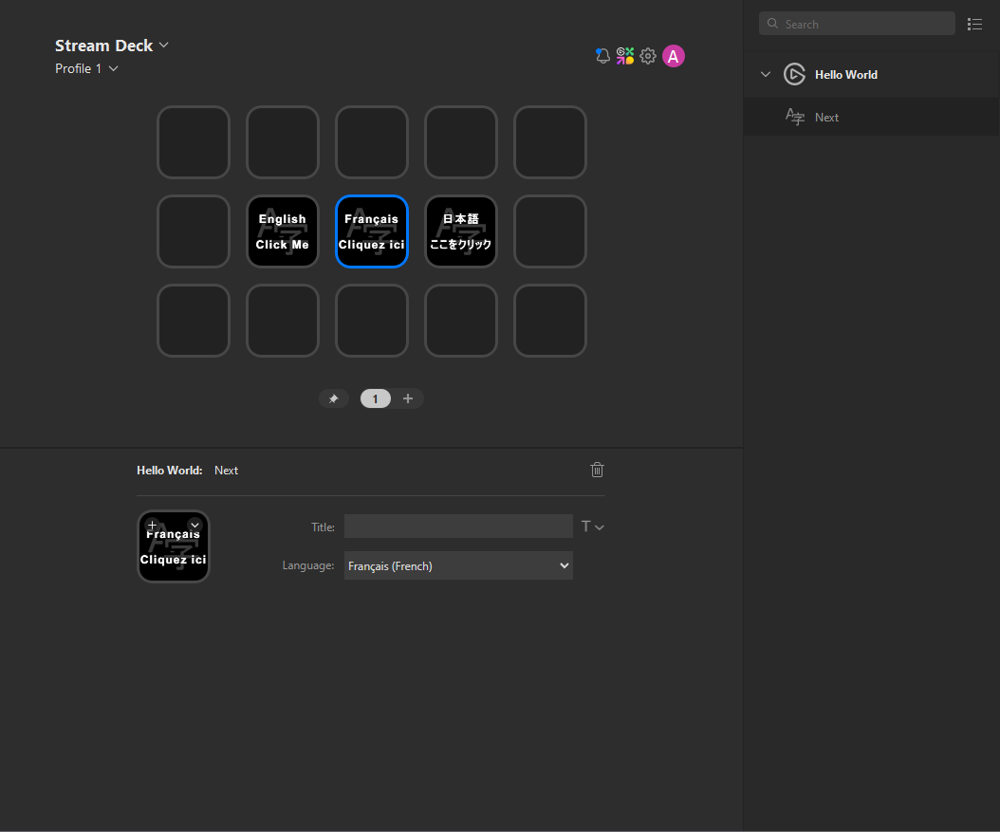

# Hello World

This is a simple plugin which demonstrates how you can include multi-language support within your plugin.

Presently, Stream Deck, and by extension the Stream Deck SDK, supports the following languages:

- Chinese (Simplified)
- English
- French
- German
- Japanese
- Korean
- Spanish

## Internationalization (i18n) support

The Hello World plugin provides an example demonstrating how you can include multiple locale files, and it uses `streamdeck.i18n` to handle looking up strings in the locale of the user's system, or for a specific language.

## `onWillAppear`

Use of `onWillAppear` is demonstrated here for ensuring the settings for an action are valid, and for setting up initial Stream Deck state.

## Property Inspector (UI) / sdpi-components

A Property Inspector is a small HTML component which is displayed to the user when they wish to configure an action. The Hello World plugin demonstrates how to create a simple Property Inspector using the sdpi-components library.

## `onDidReceiveSettings`

When the Property Inspector (UI) makes a change to the settings, the Hello World plugin detects the changes with `onDidReceiveSettings`.
