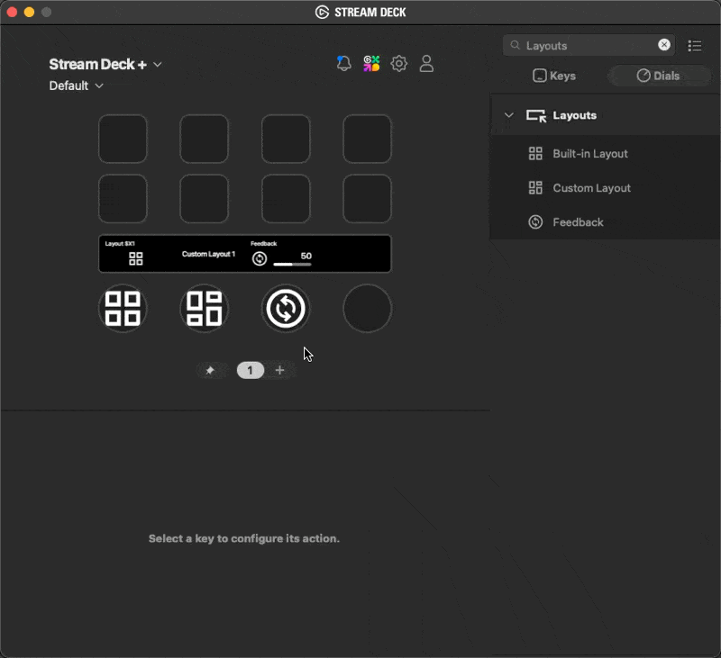

# Layouts

A plugin to demonstrate layouts for an encoders touch display.

## `setFeedbackLayout`

`setFeedbackLayout` is used to swap to both the built-in layouts as well as a custom layout provided in a `custom-layout.json` file inside the plugin folder.

## `setFeedback`

`setFeedback` updates the values of the layout currently shown on the touch display, based on the layout items key.
