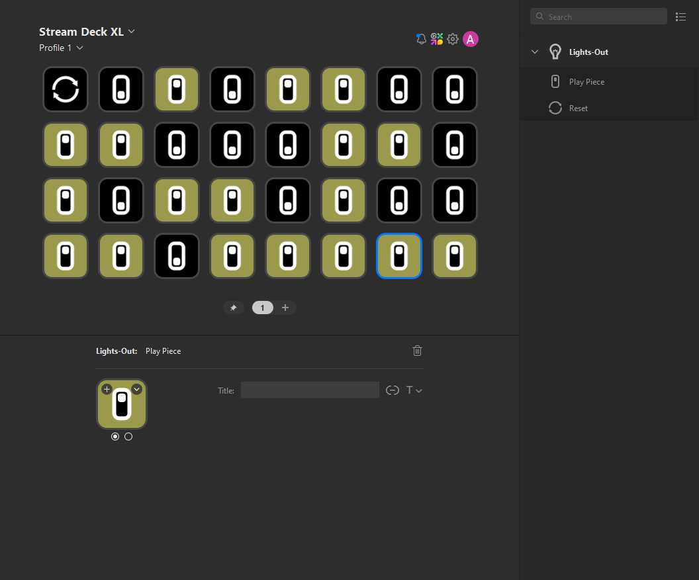

# Lights Out!

Play a game of Lights Out on your Stream Deck.

## `willAppear` & `willDisappear`

Lights Out uses these events to track game actions as they come and go as pages and profiles change.

## Position aware actions

Lights Out demonstrates how to access the position of an action on the device button matrix.

## Profiles

Lights Out imports profiles with pre-made playing fields for various Stream Deck devices.

